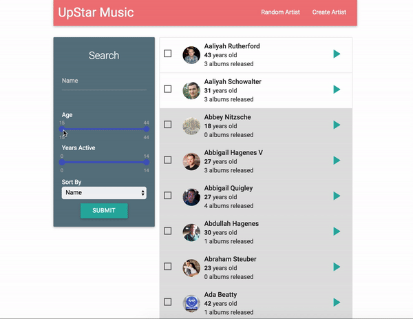

### Introduction
- Build while following the course on [MongoDB](https://www.udemy.com/the-complete-developers-guide-to-mongodb).
- Aim of this project was to get a basic understanding of MongoDb.
- App represent an artist and album library.
- Front-end is build on React-Redux. This was included in the boilerplate of this course, so this code is not being written by me.

### Functionalities
- Basic CRUD functionalities.
- Bulk update.
- Find min. & .max number of a property  in a collection.
- Filter based on text.
- Filter based on a number assigned to a property.

